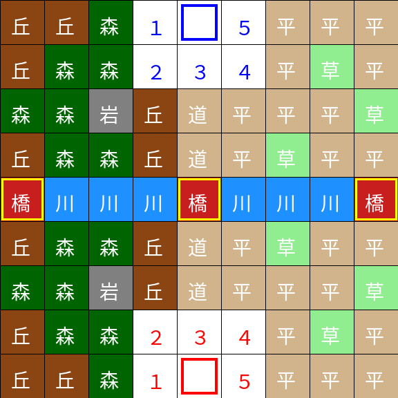

# Phase0 Balance

## 距離・経路計算：8DirectionCost10

チェビシェフ距離は使用しない。

### 理由
- 斜め移動が強すぎるため

### 仕様
- 直交移動コスト：10
- 斜め移動コスト：15（1.5倍）

### 適用
- 移動
- 射程
- AI距離評価

---

## サンプルマップ（Phase0固定）

### 概要

本マップはPhase0バランス検証用の固定マップである。  
製品版では生成マップを使用するが、現フェーズでは再現性を優先し本マップを固定使用する。

---

### 構造意図

- 中央：川＋橋 → 強制衝突ライン
- 森：視界遮断＋隠蔽 → 情報戦発生
- 草：隠蔽 → 局所奇襲
- 丘・岩：高台 → 射程・視界補正
- リスポン：占拠ゲームの成立

---

### 検証目的

このマップで以下を同時検証する。

1. 視界共有と索敵成立
2. 森越し射撃（視界遮断と射線分離）
3. ブラインドショット発生状況
4. 中央ラインでの前線形成
5. 占拠進行とリスポン停止

---

### 位置づけ

- 検証特化（うねりなし）
- 長期プレイ非対応
- 全ロールの基本挙動確認用

